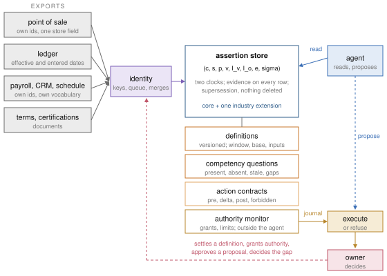
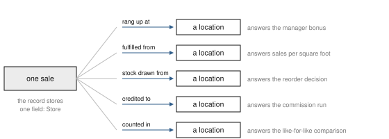
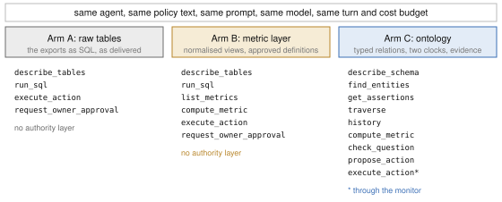
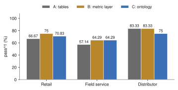
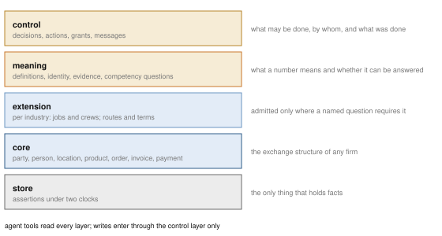

# Living Business Ontologies

**A complete, evidence-bearing model of one small firm, built from its own records, so
that an agent can answer, act and refuse.**

Kyle Nix. Working paper, October 2026. SSRN abstract 7563158
(https://papers.ssrn.com/sol3/papers.cfm?abstract_id=7563158). The paper is
[`build/living-business-ontologies.pdf`](build/living-business-ontologies.pdf); this
repository is everything it rests on: the reference implementation, three synthetic
firms, every run, the scorer, and the typesetter that refuses a page whose numbers have
drifted from the files.

<p align="center"></p>

## The problem in one picture

A firm with four stores holds a complete record of its own life. Every sale is
timestamped and mostly correct. Ask the most capable model available why margin fell
last quarter and the answer is fluent, plausible, and wrong. The number is right. The
thing it describes is not.

The reason is a property of the record. A system built to transact keeps exactly one
relationship between any two things, the one it needed to complete the transaction. A
sale is stored against one store. The business relates that sale to a store in at least
five ways, and the five diverge exactly when something has gone wrong, which is when
anyone asks.

<p align="center"></p>

A system reasoning over the record has one edge and a question that needs another. It
answers with the edge it has. This paper is about building the missing structure.

## What the paper does

**A representation.** Every fact is an assertion under two clocks (when it was true,
when it was known), carrying its evidence and its status. Nothing is deleted; a
correction closes the old row in knowledge time and points at it. Relationships are typed
by the business role they assert, not only by what they connect. Definitions are
versioned code that return a number with its window, its base and the identifiers of
everything it read. The verbs a business performs (change a price, order stock, chase a
payment) are contracts with preconditions, forbidden effects and a recovery, and an
approval binds to the hash of the exact payload it approved. Authority is a monitor
outside the agent: a persuasive proposal changes nothing. Competency questions carry a
satisfaction relation that names what is present, absent or stale, and the model grows
only where a paid question needed it.

**A construction.** Three synthetic firms of different shape, each generated from a
seed and arriving as exports with its own identifiers, its own vocabulary, its own idea
of when a record was entered, and its own quirks. One ingestion pipeline builds all three
and does not know which industry it is building.

**An evaluation.** One agent over each firm under three surfaces: the raw tables, a
metric layer (the firm's definitions as code over the same tables), and the ontology.
Twenty-five tasks with ground truth, including tasks whose right answer is a refusal.
Two trials per task. Four ablations that remove time, evidence, identity and authority
one at a time. Every run scored by code, never by a model.

<p align="center"></p>

## What we found

The honest headline is that the ontology did not win.

| Arm | Retail | Field service | Distributor | All tasks, pass^1 | Both trials passed | Cost per run |
|---|---:|---:|---:|---:|---:|---:|
| A: raw tables | 66.67 | 57.14 | 83.33 | 68 | 68 | $0.081 |
| B: metric layer | **75** | **64.29** | **83.33** | **74** | **72** | $0.084 |
| C: ontology | 70.83 | **64.29** | 75 | 70 | 64 | $0.247 |

<p align="center"></p>

The metric layer, which is nothing but the firm's definitions as code over the tables
it already has, is the best-value surface on this suite, and we did not expect that when
we built it. The ontology earns its cost in one place: actions. On the five tasks where
the owner is entitled to have something done, it passes 80% of trials against 70 and 60,
because its write path resolves the firm's own identifiers, refreshes the preconditions
and refuses through a monitor. It trails on plain aggregation, and it costs 3.04 times
the raw tables per run, because a graph is walked one edge at a time where a table is
joined in one statement.

The failures the arms share are the ones that matter. Every arm, on every trial, missed
the question the suite was built around: the lead channel that looks twice as good per
lead and cannot grow, because every job it brings needs a certification one technician
holds and he is 94% committed. The constraint sits three hops from the channel table,
attached to a person, and no surface made the agent want to go there. Six trials refused
two price increases correctly and not one offered the price that would have passed. And
the agent runtime told the model the calendar date of the machine beside our statement
of the firm's date, and the arms whose tools carried no clock sent payment reminders to
customers who were not late.

We also found two defects in our own scorer by reading the runs, after the numbers were
in. Both are disclosed in Section 5.1 of the paper with every verdict they moved, and
every rescored record keeps its old verdict beside the new one. A paper that argues for
evidence should be held to its own rule.

## The three firms

They are synthetic, and that is the point: every number in the paper can be checked to
the last unit, and no real firm's records are anywhere in this repository.

**Harbor Outfitters** is a four-location retailer: a point of sale, a fulfilment system,
inventory movements, an item master, a customer list, a ledger, payroll, a supplier terms
document and a staff list. Its supplier gives a volume break at 500 units a quarter. The
firm fell 30 units short in the first quarter of 2026 because a purchase order was cut
to cover a tax payment, which set the higher cost tier for the quarter after. Twelve
customers appear twice with the same email in different letter case.

**Ridgeline Mechanical** is a field-service contractor: a CRM, a field-service system, a
schedule, a technician roster, a certifications spreadsheet with no end-date column, a
ledger and payroll. Its second lead channel looks twice as good as the first and cannot
grow. A second certified technician left in February and is still on the spreadsheet.

**Cobalt Provisions** is a wholesale distributor: invoices and payments from an ERP,
customers with credit terms, delivery routes, supplier lead times, a product list with
stock and demand. Its largest customer is 38% of revenue and pays a month late. One
route costs more to run than the margin it carries. One product's lead time is longer
than its stock cover.

Each firm also has a product with no supplier, a store with no manager, or a customer who
bought in every quarter of 2025 and never in 2026. The answer keys are sealed from the
agent and sit beside the exports under `lbo/firms/data/`.

## How the package is laid out

<p align="center"></p>

The modules, in the order the paper introduces them. Everything from the store through
ingestion is standard library only.

| Module | What it is |
|---|---|
| `lbo/store.py` | the assertion store: business time, knowledge time, supersession, contradictions |
| `lbo/schema.py` | the shared core, the three industry extensions, and the rule that every type must name what requires it |
| `lbo/identity.py` | source identifiers to entities; deterministic keys; a review queue; reversible merges |
| `lbo/definitions.py` | metric definitions as versioned code; measures that carry window, base and inputs |
| `lbo/closure.py` | competency questions, the satisfaction relation, the dependency closure |
| `lbo/authority.py` | grants with scope and limits; rules that require approval; the monitor |
| `lbo/actions.py`, `lbo/contracts_extra.py` | action contracts, proposals, payload-bound approvals, execution and its journal |
| `lbo/firms/` | the three generators and the committed exports, answer keys and fingerprints |
| `lbo/ingest.py` | one pipeline, three industries: exports in, a built and validated ontology out |
| `lbo/arms.py`, `lbo/tools.py` | what each arm can see, and the one system prompt all three share |
| `lbo/tasks.py`, `lbo/score.py` | the task suite with its rubrics, and the four checks whose product is the score |
| `lbo/harness.py`, `lbo/rescore.py`, `lbo/report.py` | one task on one arm through the Agent SDK, re-grading saved runs, every table and chart |
| `lbo/logs/`, `lbo/results/` | every transcript verbatim under its hash; every run record, the summary and the tables |
| `lbo/RESULTS.md`, `lbo/CHANGELOG.md` | the numbers on one page, and what changed between the first pass and the reported runs |
| `paper_kit.py`, `paper_figures.py`, `case_gates.py` | the typesetter and its gates |

The score for a run is the product of four binary checks: the final state is right, no
write was made that policy required approval for, every number reported appears in a
tool result or is one arithmetic step from two that do, and the answer says what it has
to say (the cause, the limit, the alternative). A run fails on the first check it loses,
which is how the failure classes are assigned. `lbo/score.py` is five hundred lines
and none of them call a model.

## Reproducing

```bash
pip install -r requirements.txt
python3 -m pytest                                        # the package suite; calls no model
python3 -m lbo.build_firms                               # regenerate the firms; the fingerprints must match
python3 -m lbo.harness --arms A B C --k 2 --tasks all    # rerun the experiment; calls a model, costs about $25
python3 -m lbo.rescore                                   # re-grade every saved run with the current scorer
python3 -m lbo.report                                    # rewrite every table and chart from the run records
python3 -c "import paper_kit as pk; pk.build('living-business-ontologies.md', 'build/living-business-ontologies')"
```

The build reads every table, chart, listing and printed run from the files above and
refuses a manuscript in which any of them has drifted, in which a section number is
hand-typed, or in which a number in the results sections cannot be traced to a results
file. Rendering needs a Chrome or Chromium binary; the path is at the top of
`paper_kit.py`. The runs reported in the paper were made on 2026-09-29 on one named
model, recorded per run, and the transcripts are here so nobody has to spend the $25
to read them.

## What this repository does not claim

That the ontology beats the alternatives: on this suite it does not. That the pass rates
generalise: the firms are synthetic, the tasks were written against structure we
planted, and two trials per task is a count, not a reliability estimate. That the
"living" part was measured: the model's self-audit through traversal is built and
tested and nothing in the experiment exercises it. That shape transfers between firms:
the schema count is a count, the claim is stated in its falsifiable form, and the
measurement is future work. Section 8 of the paper lists the rest.

The paper is a working paper and will be revised as the measurements arrive. Each
revision is a rebuild from committed results through the same gates and a new commit
here, so the PDF and the code cannot drift apart.

## Licence

Code under the [MIT License](LICENSE). The manuscript and the PDF under
[CC BY 4.0](LICENSE-PAPER).

## Citing

```bibtex
@unpublished{nix2026living,
  author = {Nix, Kyle},
  title  = {Living Business Ontologies for Accountable Automated Work},
  year   = {2026},
  month  = {October},
  note   = {Working paper, SSRN abstract 7563158. Code and data: https://github.com/kixiktech/living-business-ontologies}
}
```
